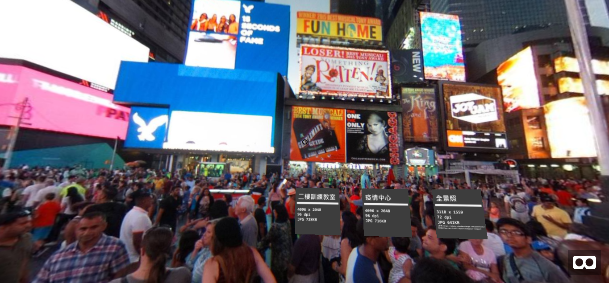
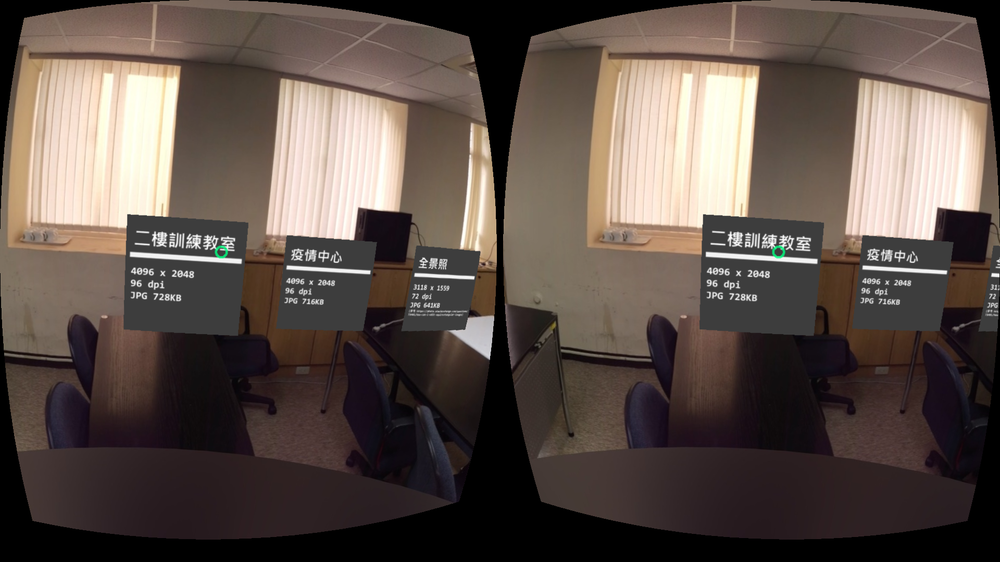
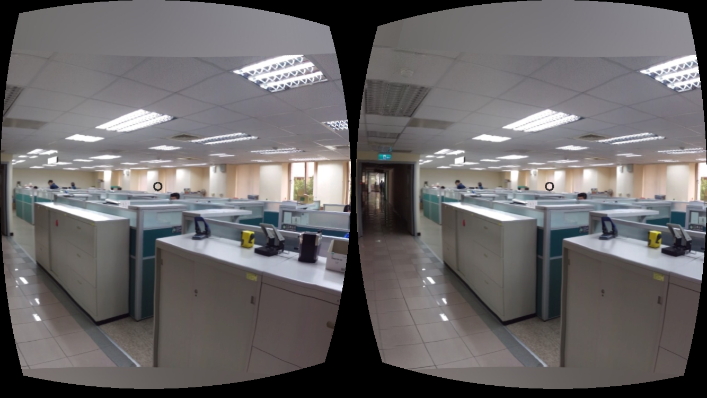

# Taiwan CDC Image WebVR Demo

A quick **WebVR** demo using panorama images. The technique is mainly using A-frame, a wonderful WebVR framework. You can even create a **cross-platform (Android, iOS) VR app** and use **Google Cardboard** to view the WebVR app.

## Get Started

* Use the cell phone to surf the link https://jiankaiwang.github.io/tcdcwebvrimage/ by the browser.
* Click the right-bottom **Cardboard** link.
* Embed the cell phone to the cardboard and enjoy it.

## Tool

* Web Virtual Reality
  * [A-Frame](https://github.com/aframevr/aframe)
* Taking Photos & Converter
  * [Cardboard 相機](https://play.google.com/store/apps/details?id=com.google.vr.cyclops)
  * [Cardboard Camera Converter](https://storage.googleapis.com/cardboard-camera-converter/index.html)

## Data

* Most data is collected from a github repository maintained by [A-Frame](https://github.com/aframevr).
* Some images are generated by ourselves.
* Image named cpucl.jpg is refered to **https://photo.stackexchange.com/questions/73481/how-can-i-edit-equirectangular-images**.

## Demo

* Desktop View

* Android Browser View (Chrome)

* iOS Browser View (Safari)

